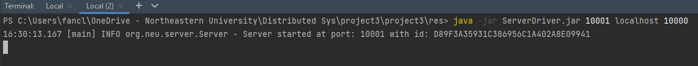

# Multi-threaded-Key-Value-Store-using-RPC

# Guidelines 
Project #3 should be electronically submitted to Blackboard by midnight on the due date.  A submission 
link is provided on the course BB page. 
 
# Assignment Overview 
For this project, you will extend Project #2 in two distinct ways. 
1) Replicate your Key-Value Store Server across 5 distinct servers.  In project #2, you used a single 
instance of a Key-Value Store server.  Now, to increase Server bandwidth and ensure availability, you 
need to replicate your key-value store at each of 5 different instances of your servers.   Note that your 
client code should not have to change radically, only in that your clients should be able to contact any 
of the five KV replica servers instead of a single server and get consistent data back from any of the 
replicas (in the case of GETs).  You client should also be able to issue PUT operations and DELETE 
operations to any of the five replicas.   
2) On PUT or DELETE operations you need to ensure each of the replicated KV stores at each replica is 
consistent.  To do this, you need to implement a two-phase protocol for updates.  We will assume no 
servers will fail such that 2 Phase Commit will not stall, although you may want to defensively code 
your 2PC protocol with timeouts to be sure.  Consequently, whenever a client issues a PUT or a 
DELETE to *any* server replica, that receiving replica will ensure the updates have been received (via 
ACKs) and commited (via Go messages with accompanying ACKs).  
As in project #1, you should use your client to pre-populate the Key-Value store with data and a set of keys.  The 
composition of the data is up to you in terms of what you want to store there.  Once the key-value store is 
populated, your client must do at least five of each operation: 5 PUTs, 5 GETs, 5 DELETEs. 
    
Your implementation may be written in Java.  Your source code should be well-factored and well-
commented. That means you should comment your code and appropriately split the project into multiple 
functions and/or classes; for example, you might have a helper function/class to encode/decode UDP 
packets for your protocol, or you might share some logic between this part of the assignment and the 
TCP client/server in the next part. 

## How to Run:

```java
// go to the directory res/ to execute following commands
// run coordinator first, and specify a port for it to register RMI
java -jar CoordinatorDriver.jar <port>

// then run five server instances
// repeat the following code five times with different server port but the same coordinator hostname and port in different terminals   
java -jar ServerDriver.jar <server port> <coordinator hostname> <coordinator port>   

// finally run client with five servers' hostnames and ports, and specify the client port at tail
java -jar client.jar <hostname1> <port1> <hostname2> <port2> <hostname3> <port3> <hostname4> <port4> <hostname5> <port5> <client port>    
```


## Examples with description:

- Coordinator start:

  

- Server start:

  - server 1
    
  - server 2
    
  - server 3
    
  - server 4
    
  - server 5
    

- Client start:

  

- Client input example:

  

- Client output example:

  

## Assumption:

Assume the coordinator will never crash.

Servers can crash at any phase of a transaction and if a server crash, it will throw a RemoteException. No fake death or any Byzantine problem.

Level 1 crash recovery (present the test in video).

Crash recovery will only be triggered when the server is absent in transactions, if no transactions occurred, the server crash and reconnect to the coordinator will not trigger the data synchronization.

## Limitation:

Client needs exactly five servers start first, then it is able to run.

Client needs to be manually restarted to reconnect with a crash server. Because server will lose the information of the client after its process shutdown. Client can detect and give notification to user if the connected server is down, but it needs the client to call the server API, then it will be triggered because the RemoteException is caught. No dynamic detection.

Server will lose data and client information because the database is an object instance in the server rather than an individual server.

Data recovery will recover all transactions' data since the coordinator started and recorded, cannot work on a single data roll back instead all data to keep consistent with other servers.
